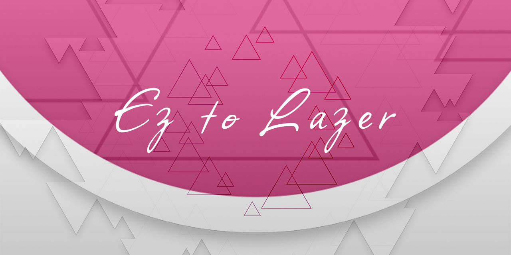

<p align="center">
  
</p>

<div align="center">
    <a href="https://github.com/SK-la/Ez2Lazer/releases" target="_blank"></a>  
    <a href="https://github.com/SK-la/Ez2Lazer/wiki" target="_blank"></a>
    <a href="https://github.com/SK-la/Ez2Lazer" target="_blank"></a>
    <a href="https://github.com/SK-la/ez2lazer-framework" target="_blank"></a>
    <a href="https://github.com/SK-la/ez2lazer-resources" target="_blank"></a>
    <a href="https://space.bilibili.com/4100834" target="_blank"></a>

</div>

<div align="center">

[**English**](README.md) | [中文](README.zh-CN.md)

</div>

# Ez2Lazer

Ez2Lazer is a heavily customized branch based on osu! lazer, focused on Mania/BMS workflows, configurable HUD, switchable judgement systems and analysis tools.

## Licence

Ez2Lazer is based on [osu!](https://github.com/ppy/osu), licensed under the [MIT licence](https://opensource.org/licenses/MIT).  
See [LICENCE](LICENCE) for details. Upstream copyright remains with ppy Pty Ltd; Ez2Lazer modifications are by SK-la.

This does not cover usage of "osu!" or "ppy" branding, which is protected by trademark law.  
Game resources are covered by a separate licence in [ppy/osu-resources](https://github.com/ppy/osu-resources).

## Download and Run

- Latest releases: [SK-la/Ez2Lazer Releases](https://github.com/SK-la/Ez2Lazer/releases)
- Resource pack: [EzResources (OneDrive)](https://la1225-my.sharepoint.com/:f:/g/personal/la_la1225_onmicrosoft_com/EiosAbw_1C9ErYCNRD1PQvkBaYvhflOkt8G9ZKHNYuppLg?e=DWY1kn)
- Runtime: [.NET 10 Desktop Runtime](https://dotnet.microsoft.com/download/dotnet/10.0)

**Auto-update (recommended)**  
- Windows: use `ez2lazer-win-Setup.exe` from Releases (requires [.NET 10 Desktop Runtime](https://dotnet.microsoft.com/download/dotnet/10.0)); in-game updates download deltas afterward.  
- For manual installs use `Ez2Lazer_release_*.zip`; zip installs cannot receive delta updates until you switch to Setup once.

> Without EzResources, Ez Pro Skin and Ez HUD widgets will miss textures.

## Documentation

The full documentation now lives in Wiki; this README stays as a quick index.

- Home: [Ez2Lazer Wiki](https://github.com/SK-la/Ez2Lazer/wiki)
- Overview: [Feature Overview](https://github.com/SK-la/Ez2Lazer/wiki/Feature-Overview-English)

### Feature Areas
- [Song Select](https://github.com/SK-la/Ez2Lazer/wiki/Song-Select-English)
- [Game Settings](https://github.com/SK-la/Ez2Lazer/wiki/Game-Settings-English)
- [Skin System](https://github.com/SK-la/Ez2Lazer/wiki/Skin-System-English)
- [Mod System](https://github.com/SK-la/Ez2Lazer/wiki/Mod-System-English)
- [HUD Widgets](https://github.com/SK-la/Ez2Lazer/wiki/HUD-Widgets-English)
- [Editor](https://github.com/SK-la/Ez2Lazer/wiki/Editor-English)
- [Judgement and Health](https://github.com/SK-la/Ez2Lazer/wiki/Judgement-and-Health-English)

## Quick Setup

1. Download the program and extract it to any folder.
2. In settings, use `Change folder location` to point at your data path.
3. Download and extract EzResources into that path (so it sits at `.../EzResources`).

Full steps: [Installation Guide](https://github.com/SK-la/Ez2Lazer/wiki/Installation-Guide-(English))

## Build Instructions

```bash
git clone https://github.com/SK-la/Ez2Lazer
git clone https://github.com/SK-la/ez2lazer-framework
git clone https://github.com/SK-la/ez2lazer-resources
```

Versions of `ez2lazer.Framework` and `ez2lazer.Game.Resources` are maintained in [Ez2Lazer.Dependencies.props](Ez2Lazer.Dependencies.props).

To use local sibling projects during development, toggle the two switches independently:
- `<UseEz2LazerLocalFrameworkProject>true</UseEz2LazerLocalFrameworkProject>` / `-p:UseEz2LazerLocalFrameworkProject=true`
- `<UseEz2LazerLocalResourcesProject>true</UseEz2LazerLocalResourcesProject>` / `-p:UseEz2LazerLocalResourcesProject=true`

Set the matching switch back to `false` to return to the NuGet reference.

Self-built copies hide in-game update settings and do not check SK-la/Ez2Lazer Releases for updates.

## Special Thanks
- [osu!](https://github.com/ppy/osu): The original game and framework.
- [YuLiangSSS](https://osu.ppy.sh/users/15889644): Contributed many fun mods.
- [g0v0](https://github.com/GooGuTeam/g0v0-server): Private server support.
- [mania-hub](https://github.com/aleju03/mania-hub): Data display inspiration.
- [MinaCalc](https://github.com/etternagame/etterna): Skill algorithm.
