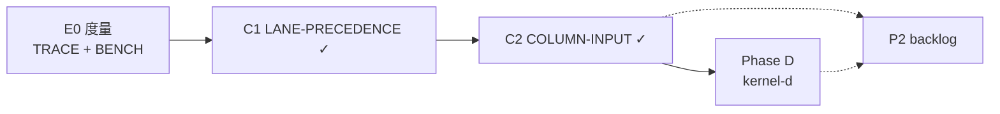

# Mania 高 KPS 判定性能 — 代号 backlog

> **定位**：高密度谱面 / 高按键吞吐（社区口径可达 ~90 KPS 量级）下的**全 HitMode**热路径优化清单。  
> **与主题关系**：依附「局内冻结判定平面」主线（`ManiaJudgementRound` → `ManiaLaneController` → `ManiaJudgementKernel`），**不**替代架构重构；本文件只记录性能专项。  
> **黄金标准不变**：任何优化不得破坏 `TestSceneReplaySessionParity` / `ManiaCrossSourceInvariantTest` / `ManiaJudgePrecedenceParityTest`。
> **FPS 现象 / 观测口径 / bench 索引**：统一见 [`EZ-PERFORMANCE.md`](./EZ-PERFORMANCE.md)；本文件只列判定热路径的优化项。  
> **按键延迟实测结论**（`PreColumnMs` 是等帧而非派发开销、`ColumnMs` p50 0.101 ms、>8 ms 停顿只在开局/退出帧）：见 [`EZ-PERFORMANCE.md`](./EZ-PERFORMANCE.md) §2.4。判定热路径按该结论**不再是按键延迟的嫌疑项**。

---

## 已落地（主线 Phase A–C）

| 代号 | 内容 | 受益 HitMode |
|------|------|----------------|
| **ROUND-FREEZE** | `ManiaJudgementRound` 开局冻结 env / strategy / flags | 全部 Ez |
| **ENV-ONE** | `ResolveEnvironment(purpose, score?, offset?)` 统一解析 | 全部 |
| **WINDOW-BAKE** | `ManiaWindowBaker.Align` 开局对齐 HitMode + 非 O2 窗口 | 全部 Ez + Session |
| **O2-NOMUTATE** | O2 用户判定走 `ResultFor(bpm)`，去掉 per-note `updateWindows()` | O2Jam |
| **O2-FRAME-BPM** | auto-miss 同帧共享一次 `GetBPMAtTime` | O2Jam |
| **LANE-CURSOR** | Earliest：`ManiaLaneController` 列内有序目标 + 游标 | 全部（Earliest） |
| **LANE-PRECEDENCE** | Combo / Duration / BMS post-Bad：`CollectOverlappingEntries` + `SelectPressEntry`；Session `ManiaLanePressSelector` | 全部 |
| **COLUMN-INPUT** | `Column.OnPressed` → `TryRoutePress` → 单 target；`ManiaKeyBindingContainer` 列优先队列；drawable `ShouldSkipColumnRoutedPress` 兜底 | 全部 |
| **TRACE-JUDGE** | `ManiaJudgeHotPathTrace`（`IsHittable` / `CheckForResult` / O2 BPM / press 计数） | 观测 |
| **BENCH-KPS** | `BenchmarkManiaReplaySession`：jack 80ms×4K + 三档 `JudgePrecedence` | 观测 |
| **PERF-IDLE-PRESS** | 增量 lane index、列 press 去重、`KeyBindingInputQueue` 无 `ToList`、O2 press 无 `maniaWindows.BPM` 突变 | 全部 |
| **AUTO-MISS-GATE** | `ManiaAutoMissGate.ShouldEvaluateAutoMiss` 未进 miss 早窗早退；**Empty 窗（Hold/Body）至 EndTime 前也早退** | 全部 Ez |
| **O2-PILL-1PASS** | press 路径 `PillCheckWithBpm` + `EvaluatePress(NotePressContext)` | O2Jam |
| **MISS-STORED-OFFSET** | Drawable 被动 miss / Session end-sweep：`ResolveMissStoredOffset`（列 press 最近邻） | 全部 |
| **FORCE-MISS-WINDOW** | Session `ForceMissEarlier` 跳过 miss 窗外物件（对齐 `IsUserTriggerJudgeableNow`）；枚举不再预写 `Judged` | Lazer/Classic + Session |
| **INPUT-QUEUE-FRAME** | `ManiaKeyBindingContainer.KeyBindingInputQueue` 一次枚举分「列/非列」两列表并按帧物化（原先每次枚举都重建整棵子树队列，且同帧每 binding 各建一次） | 全部 |
| **SAMPLE-NO-LINQ** | 按键预览取样 `GetMostValidObject` 去 LINQ/排序与递归迭代器；`Play()` / `PlaySamples()` 去 `Cast` 迭代器 | 全部 |
| **LN-INPUT-SLOT** | `DrawableHoldNoteHead` / `DrawableHoldNoteTail` 默认 `HandleNonPositionalInput = false`；按键仍由父 Hold 处理。Debug 可用 `ManiaHoldAblation.EnqueueHoldEnds` 强制入队 | LN |
| **LN-HOLD-FBO** | `DefaultBodyPiece` 按住时隐藏减法层并跳过 `ForceRedraw`；松手恢复内孔。仅 Default/Triangles | LN |
| **LN-ABLATION** | Debug-only：`ManiaHoldAblation` + `TestSceneManiaHoldDrawCost` + LN 热路径计数。Release 编译期剥离 | 观测 |
| **FW-BUTTON-QUEUE-REUSE** | `osu-framework` `ButtonEventManager` 按下 / 抬起队列改为每按钮一份复用缓冲（去 `ToList()` 与 `Where().ToList()` 的按次列表分配） | 全部（framework `56e9beb2c`） |

---

## 暂缓（Phase D — 性能回归，profile 后再议）

| 代号 | 说明 |
|------|------|
| **STATE-ONE** | O2 Pill / BMS KPoor 路由状态合并进 `ManiaReplayJudgementState` |

## Phase D 进行中（`mania-judgement-kernel-d`）

| 代号 | 说明 |
|------|------|
| **KERNEL-ONE** | [x] `ManiaJudgementKernel`：Drawable + Session 共用 note/hold-tail 判定 |
| **DRAWABLE-THIN** | [x] `ManiaEzDrawableJudgement` 收敛为 kernel → ApplyResult（保留 AutoMissGate / stored offset） |
| **BMS-PRESS-CORE** | [x] `evaluatePressCore` 统一 Drawable / Session BMS press |

---

## 待办（P2 可选后续）

| 代号 | TODO | 说明 |
|------|------|------|
| **O2-COLUMN-BPM** | [x] `Column.OnPressed` 每列每按键 `NotifyO2InputAt` | O2Jam |
| **BMS-ROUTE-COL** | [ ] tail `BmsRouteState` 完全列级化 | BMS |
| **HOLD-TAIL-FAST** | [ ] `Column.OnReleased` → 列级 tail release | LN |
| **SOUND-DECOUPLE** | [ ] 判定与 `sampleTriggerSource.Play()` 解耦（注：`KeySoundPreviewMode.Off` 目前也会触发取样，只有 `AutoPlayPlus` 排除，会与 note 音互相 choke） | 仅 profile 证明阻塞时做 |
| **INPUT-QUEUE-FW** | [x] 已定案：框架侧共享队列构建**不可做**（`TestSceneInputQueueChange.CombinedClicks` 证伪，drawable 事件中移动后同帧按键必须看到重建队列） | 见 `EZ-PERFORMANCE.md` §2.1 **FW-INPUT-QUEUE-DISPATCH**；去分配部分已落地。**按键延迟实测后不再重开**：`PreColumnMs` 已证明是「等下一帧」而非派发开销，见 §2.4 |
| **COLUMN-EARLY-OUT** | [ ] 列路由成功后早退：`PropagatePressed` 的截断会让 `ReplayRecorder` / `KeyCounterActionTrigger` 收不到 Release，须先调派发顺序 | 全部 Ez |
| **DRAWABLE-MICRO-BENCH** | [x] PeakKps × alive；alloc；BMS/Poor；Empty gateTrue==0 | gate 主导；valid 表曾 `new[]` |
| **STORE-FRAME-BUDGET** | [x] `DetachedBeatmapStoreFrameBudget` Drain≤24 + 单测 | 选歌 Replace 风暴 |
| **BDSP-STARTUP-DELAY** | [x] `StartupBackfillDelay` 5s；测试覆写 0 | 选歌开工掉帧 |

---

## 明确不在本 backlog 内

- 游戏中禁止改 HitMode/HealthMode 的 **UX**
- Lazer/Classic `Lazer*Replica` 与 ppy inline 合并
- `OffsetPlusMania` Realm 持久化
- **POLICY-PARITY** — 已落地测试，见 [`REPLAY_JUDGE_MERGE-Mania.md`](./REPLAY_JUDGE_MERGE-Mania.md) §4

---

## 阶段路线（E0 → C 已完成）

**预期收益（定性）**

- **C1**：Combo/Duration 叠键列 O(存活数) → O(窗口内候选数)
- **C2**：每键 `CheckForResult` O(存活数) → O(1)
- **整体**：Drawable 与 Session 在列级 target 选择层面对齐

**下一步默认**：`mania-judgement-kernel-d` 实机 profile 对比 `mania-perf-fix`；`STATE-ONE` 与 P2 按 profile 排期。

---

## 修订记录

| 日期 | 说明 |
|------|------|
| 2026-07-06 | 初版：全 HitMode 高 KPS backlog；Phase A/B 已落地项归档 |
| 2026-07-06 | Phase C 完成：`LANE-PRECEDENCE` + `COLUMN-INPUT`；Phase D 标注暂缓 |
| 2026-07-07 | `mania-perf-fix`：idle/press 热路径减负 + 叠键 miss `TimeOffset` parity（`MISS-STORED-OFFSET` / `FORCE-MISS-WINDOW`） |
| 2026-07-07 | `mania-judgement-kernel-d`：`KERNEL-ONE` + `DRAWABLE-THIN`；O2-NOMUTATE；BMS auto-miss stored offset |
| 2026-07-14 | `DRAWABLE-MICRO-BENCH`：10 列叠 LN PeakKps 20/50/100（Select/Gate/pressTimes，不含 SwapBuffer） |
| 2026-07-14 | MICRO-BENCH 加深：alive 扫描；MLC scratch / Select Func；`HitModeHelper` valid 表静态化（ResultFor 零分配） |
| 2026-07-14 | 可测排除：AutoMissGate / BMS-Poor bench / FrameBudget Drain / BDSP delay 覆写 |
| 2026-07-14 | 局内 FPS 回归：MissEarly 烘焙 + ShouldDefer 内联 + ResultFor valid O(1)；二分基线 `f161089f75^` |
| 2026-09-20 | `INPUT-QUEUE-FRAME` + `SAMPLE-NO-LINQ` 落地；新增 P2：`INPUT-QUEUE-FW` / `COLUMN-EARLY-OUT` / `LN-INPUT-SLOT` |
| 2026-09-21 | `LN-INPUT-SLOT` + `LN-HOLD-FBO` 生产落地；`LN-ABLATION` 仅 Debug。消融：静止 `ΔBodyFbo≈0`，按住缩体才 ForceRedraw |
