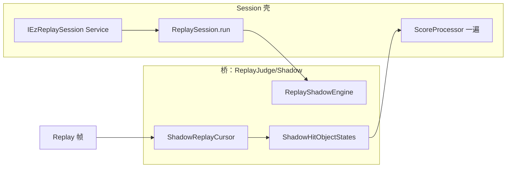

# Replay Shadow Judgement（Osu / Catch / Taiko）

Ez2Lazer 在 **Mania 以外** 的三模式（Osu、Catch、Taiko）曾用 **Shadow** 作为 Session 脱离 Drawable 的**过渡桥**。  
Shadow **不是终态**：parity 绿后须抽纯函数给 Drawable 共用（§允许），再接 ClassicNative 等产品轨。

相关：

- 框架注册表：[EZ-SR-TL-REGISTRY.md](./EZ-SR-TL-REGISTRY.md)（OSL-011+）
- Mania（独立路径）：[REPLAY_JUDGE_MERGE-Mania.md](./REPLAY_JUDGE_MERGE-Mania.md)
- Osu 落地：[REPLAY_JUDGE_MERGE-Osu.md](./REPLAY_JUDGE_MERGE-Osu.md)

---

## 1. 与 Mania 的关系（现行 → 修订中）

| | Mania | Osu / Catch / Taiko（桥阶段） | 毕业后目标 |
|---|--------|------------------------------|------------|
| 模式切换 | 多种 Ez HitMode | 桥阶段无 HitMode 菜单 | Osu：**Lazer \| ClassicNative** 第二轨（OSL-013；修订原「永不引入」假设） |
| 判定源 | Ez Mapping 与 Drawable 共用；Lazer 用 Replica | Shadow **镜像** Drawable | **抽出 helper/Mapping**，Drawable 一行 + Session 同调 |
| Session 目标 | env 可切换重算 | 能无 Drawable 出 HitEvents/Timeline | 达 Mania 级：共用判官 + env 真读 + 消费矩阵 |

**禁止**把 Shadow 树复制到 Taiko/Catch 当永久架构；后继模式跟随 Osu **毕业后的 Mapping 形态**（允许极短 Shadow bootstrap，须在 REGISTRY 写删除里程碑）。

---

## 2. 影子判定（Shadow Judgement）定义

**影子判定** = 无绘制、按 replay 时钟推进，维护与 Drawable/ReplayPlayer **等价的逻辑状态**，在正确时刻向 `ScoreProcessor.ApplyResult` 喂入 `JudgementResult`。

**禁止**：

- 生产路径 HeadlessGameHost 跑完整 `DrawableRuleset`
- 第二遍 HitEvents → SP（F 类）
- 为 Session 单独维护与 Drawable 无关的 press 启发式

**允许 / 出口（OSL-011）**：

- 首版在 Ez 侧移植 Drawable 判定段落；parity 绿后，将纯函数提取到 ruleset helper，Drawable 改一行调用（非行为变更），Session 删对应 ShadowState

---

## 3. 分层

| 层级 | 职责 | Osu | Catch / Taiko |
|------|------|-----|----------------|
| `EzOsuGame/Scoring` | `IEzReplaySession`、Timeline、Race、cache | ✓ | 同形接线（TTL/TSL） |
| `Rulesets.*/Ez*/ReplayJudge/` | `*ReplaySession` / Service | OSL-007 **done** | 待建（Mapping 形态） |
| `.../ReplayJudge/Shadow/` | 过渡桥 Cursor + Engine + States | **OSL-010 bridge done**；**OSL-011 拆桥中** | 禁永久 Shadow；见 Osu 毕业路径 |
| `*ScoreHitEventGenerator` | 薄壳委托 Service | **done** | 同形 |

命名（桥期）：

- `{Mode}ShadowReplayCursor` — replay 插值 + 按键边沿
- `{Mode}ReplayShadowEngine` — 时钟主循环 → ApplyResult
- `{Mode}Shadow{Object}State` — 对象状态机（毕业后删除）

**环境**：桥阶段 Osu Session **尚未**消费 `IGameplayEnvironment` 中的模式轨字段（代码曾 `_ = environment`）。**OSL-012** 起须真读 env（为 ClassicNative / offset 等铺路）。不读 Mania 专用 `ManiaHitMode` 分支，除非产品明确复用。

---

## 4. 黄金标准

> 同一 score + 同一 environment 下，`ReplaySession.Run` 的 **HitEvents + Score** 必须与 ReplayPlayer 一遍后 `ScoreProcessor` 字段级一致。

Parity：各 ruleset `TestScene*ReplaySessionParity`。

---

## 5. 实施顺序

| 阶段 | Ruleset | 注册 ID | 内容 |
|------|---------|---------|------|
| **done** | Osu | OSL-007~009 | Session 壳 + Builder/Generator |
| **bridge done** | Osu | **OSL-010** | Shadow S1–S4 + Parity |
| **open** | Osu | **OSL-011** | 抽 helper；Drawable 一行；缩/删 Shadow |
| **open** | Osu | **OSL-012** | Session 真读 env；消费矩阵 |
| **open** | Osu | **OSL-013** | ClassicNative 第二轨 + 计分 |
| **open** | Taiko | TTL-* | Mapping 形态 Session（非永久 Shadow） |
| **open** | Catch | TSL-* | 同上 |

---

## 6. OSL-010 子阶段（已完成，归档）

| PR | 内容 | 状态 |
|----|------|------|
| S0 | 本文 + MERGE-Osu + REGISTRY | done |
| S1 | Cursor + Circle + Engine；删 Simulator press 循环 | done |
| S2 | `ShadowSliderState` | done |
| S3 | `ShadowSpinnerState` | done |
| S4 | `TestSceneOsuReplaySessionParity` | done |
