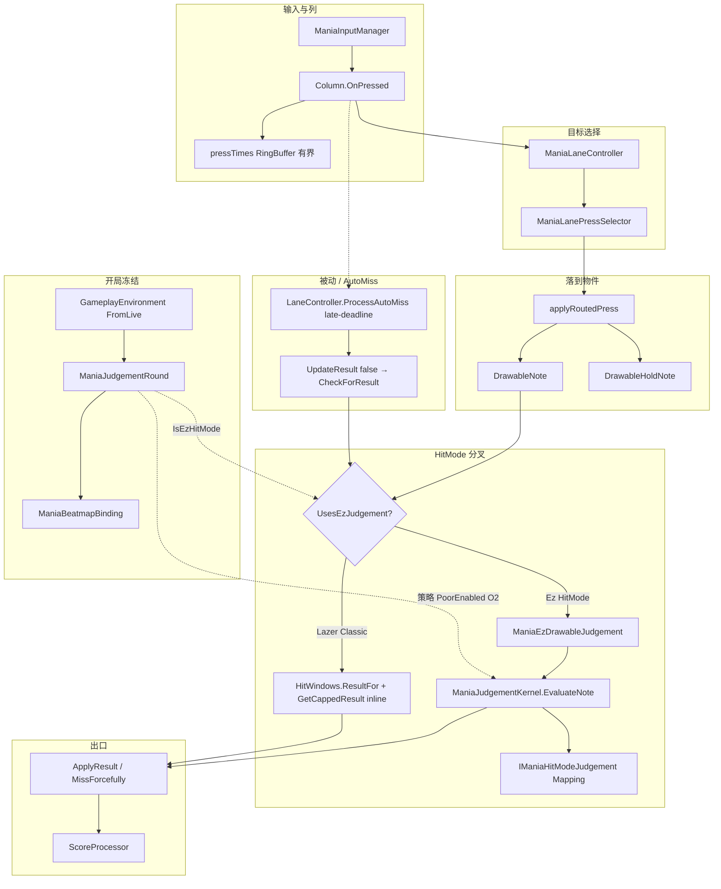
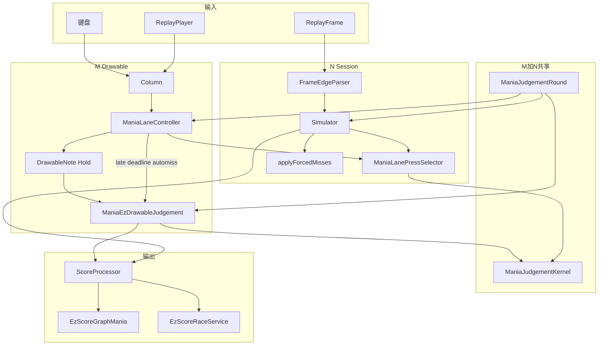
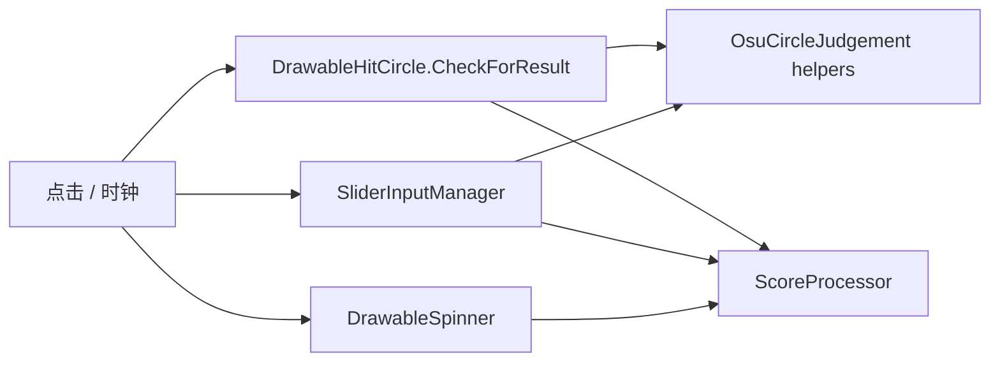

# Mania 局内判定 — 运行时架构

> **写给谁**：要弄清「局里怎么判、哪层与 Session 同调、哪层仍双份」的人。  
> **姊妹文档**：[`MANIA-SCORE-DATA-SOURCE-REGISTRY.md`](./MANIA-SCORE-DATA-SOURCE-REGISTRY.md)（成绩数字从哪读）；[`REPLAY_JUDGE_MERGE-Mania.md`](./REPLAY_JUDGE_MERGE-Mania.md)（Session 字段 parity）；[`EZ-SR-TL-REGISTRY.md`](./EZ-SR-TL-REGISTRY.md)（跨模式 Timeline/Race）。  
> **本文件职责**：局内（M）拓扑 + M/N 共享边界 + 部件/绑定决策 + 删双份统一顺序（已吸收原 TOPOLOGY 现行架构；历史性能批次见 [`EZ-PERFORMANCE.md`](./EZ-PERFORMANCE.md)）。  
> **状态**：2026-10-06 — 定稿；痛点证据暂定可覆盖。

---

## 0. 一句话

Ez Mania 在官方「画面上有音符、按了算分」之上加了：多 HitMode，以及 **M（局内 Drawable）≡ N（Session 无画面重算）**。  
**Ez 轨的「等级怎么判」已进共用 Kernel**；对齐税集中在 **Lazer 数学双轨 + 驱动层镜像（AutoMiss / LN / miss offset）**。

---

## 1. 角色速查

| 角色 | 类 / 模块 | 出现 |
|------|-----------|------|
| 舞台列 | `Column` | 仅 M |
| 列状态机 | `ManiaLaneController` | 仅 M |
| press 选目标（纯函数） | `ManiaLanePressSelector` | **M+N** |
| 音符 / LN | `DrawableNote` / `DrawableHoldNote` | 仅 M |
| 本局规则手册 | `ManiaJudgementRound` | M+N 各建，语义同源 |
| 判官 | `ManiaJudgementKernel` + Mapping | **Ez M+N 共用** |
| Lazer 数学 | M：Drawable inline；N：`Lazer*JudgementReplica` | **双轨** |
| 记分员 | `ScoreProcessor` | M+N |
| N 录像室 | `ManiaReplaySession` / `Simulator` | 仅 N |

---

## 2. 局内判定拓扑（不含 Session 驱动）

### 2.1 层职责

| 层 | 锚点 | 做什么 | 不该做 |
|----|------|--------|--------|
| **L0 冻结** | `ManiaJudgementRound`（`DrawableManiaRuleset.LoadComplete`） | HitMode / Strategy / PoorEnabled / Precedence 开局一次 | 热路径再读 `GlobalConfigStore` |
| **L3 输入** | `Column.OnPressed` | 记有界 `pressTimes`、键音、列路由 | 自己算 HitResult |
| **L2 路由** | `ManiaLaneController` + `ManiaLanePressSelector` | 叠键目标、force-miss 前序、AutoMiss 队列 | 窗口→等级映射 |
| **L2 判官** | `ManiaJudgementKernel` → Mapping | `timeOffset → HitResult` / BMS action | UI、输入历史 |
| **L3 呈现壳** | `DrawableNote` / Hold | `ApplyResult`、视觉、LN 持有态 | 复制第二套窗口数学 |

### 2.2 路径 A — 用户按键（列路由开）

1. `ManiaInputManager` → `Column.OnPressed`
2. `pressTimes.Add` + 有界 `Trim`（miss stored offset / parity）
3. `LaneController.SelectPressEntry` → **`ManiaLanePressSelector`**
4. `applyRoutedPress` → Note / Hold
5. **Ez**：`TryBmsOnPressed` 或 `UpdateResult(true)` → `ManiaEzDrawableJudgement` → **Kernel** → Mapping  
   **Lazer**：`HitWindows.ResultFor` **写在 Drawable 里**（不经 Kernel）
6. 命中后 `handleHit` → `CollectForceMissBefore` → 前序 `MissForcefully`

### 2.3 路径 B — 被动 AutoMiss

1. `Column` late-deadline → `LaneController.ProcessAutoMiss`
2. 到期物件 `UpdateResult(false)` → `CheckForResult(false, …)`
3. Ez 仍进 Kernel；Lazer 走 `CanBeHit` → `EzApplyPassiveMissWithStoredOffset`

---

## 3. M/N 共享与双份表（标在同一拓扑上）

| 盒子 | Session 同调？ | 现状 | 对齐税 |
|------|----------------|------|--------|
| L0 Round / env | 是（各建一份，语义同源） | 单源概念 | 低 |
| Kernel + Mapping（Ez） | **是** — Simulator 调 `EvaluateNote` / `EvaluateHoldTail` | Ez 判定数学单源 | 低 |
| `ManiaLanePressSelector` | **是** — MLC 与 Simulator 同调纯选择 | 选择语义已单源 | 低 |
| `ManiaLaneController` 状态 | **否** — N 用 `LaneTargetState` | 状态机分离（刻意） | 中（语义漂移时） |
| AutoMiss 时机 | **镜像** — N 自有 deadline；公式应对齐 | 驱动双份 | **高** |
| Lazer `CheckForResult` inline | **否** — N 用 `Lazer*JudgementReplica` | **最重数学双份** | **最高** |
| `pressTimes` / miss stored offset | **镜像** — N 用 replay 边沿；公式应对齐 | Fix-1 后 M 侧有界 | 中 |
| LN ActiveHold | **镜像** — Simulator 对齐 `OnReleased` | 状态机双份 | **高** |
| Drawable 视觉 / 键音 | 仅 M | 不必进 Session | — |

**结论**：Ez「等级怎么判」已共用 Kernel；痛点在 **Lazer 数学双轨** 与 **AutoMiss / LN / miss-offset 驱动镜像**。

---

## 4. 反模式目录

| ID | 反模式 | 现状 |
|----|--------|------|
| AP-1 | Drawable 无限 `pressTimes` + Miss 全表拷贝 | **已修**（有界 RingBuffer + 零分配 MissTiming） |
| AP-2 | 每 alive Drawable 每帧 `UpdateResult` automiss | **已修**（Column late-deadline 队列；旧 `ManiaAutoMissGate` 已删） |
| AP-3 | 每按整列扫 overlap | **已修**（register 时 max 窗缓存） |
| AP-4 | 热路径读全局 config | L0 Round 冻结；少数预览旁路仍 ❓ |
| AP-5 | 为 parity 在 L3 再造一套窗口数学 | **Lazer inline vs Replica 仍违** |
| AP-6 | Headless 整棵 DrawableRuleset 当 Session | **禁止** |
| AP-7 | 把 Shadow 树当终态复制到其它模式 | **禁止** |

---

## 5. 痛点盒子标注

> 下列为 **证据暂定**（来自 §3 对齐税列 + TOPOLOGY 真谱缝）。可覆盖改标；改标后同步修订 §6。

| 盒子 | 暂定税级 | 依据 |
|------|----------|------|
| **Lazer inline ↔ Replica** | **P0** | 唯一仍「两份窗口数学」；改一侧必人工对齐另一侧 |
| **AutoMiss 时机（M 队列 ↔ N deadline）** | **P1** | 驱动镜像；被动 Miss / stored offset 易漂 |
| **LN ActiveHold / 断连补判** | **P1** | Simulator 注释对齐局内；历史上 ComboBreak 缝已修过多轮 |
| **pressTimes ↔ replay 边沿 miss offset** | **P2** | 公式应对齐；Fix-1 后性能税下降，语义仍要测 |
| **LaneController ↔ LaneTargetState** | **P2** | 状态分离刻意；只共享 MLPS/Kernel，不合并状态机 |
| SelectPress 选择语义 | **已降** | 已共用 `ManiaLanePressSelector` |

**覆盖方式**：在本节表格改「暂定税级」列，或回复一句「P0=…；P1=…」即可。

---

## 6. 统一顺序与改文件清单（按 §5 暂定）

本阶段 **不改代码**；下列为钉死的落地顺序，供下一实施 PR 使用。

### 批次 U1 — Lazer/Classic 数学单源（P0）

**目标**：Drawable Lazer 路径与 Session 共用同一 Lazer 策略实现；删除「inline 一份、Replica 一份」维护税。

| 动作 | 文件 |
|------|------|
| 将 Lazer note/tail/hold 窗口数学收进可被 Kernel 或 Registry 调用的策略（可先让 `LazerNoteJudgementReplica` / `LazerHoldJudgementReplica` 成为唯一数学源） | `EzMania/ReplayJudge/Replicas/LazerNoteJudgementReplica.cs`、`LazerHoldJudgementReplica.cs` |
| Registry：Lazer/Classic 也返回该策略（今日已对 Session 返回 Replica） | `ManiaJudgementRegistry.cs` |
| Drawable：`CheckForResult` Lazer 分支一行委托（经 `ManiaEzDrawableJudgement` 或 Kernel `NotHandled`→Lazer 策略），禁止再写第二套 `ResultFor` | `Objects/Drawables/DrawableNote.cs`、`DrawableHoldNoteTail.cs`、相关 Hold |
| 接口注释：去掉「Lazer 不实现本接口」的长期双轨表述，改为「Lazer 策略亦单源」 | `IManiaHitModeJudgement.cs` |

**验收**：

- 现有 `TestSceneReplaySessionParity` / OsrAudit / BMS×Lazer HM 小谱 **保持绿**
- 新增或扩展：**Lazer HitMode** 下 Drawable replay HitEvents ≡ Session（note + hold tail + passive miss）
- Graph Now / Rejudge 仍只走 Session，不新开第三套

### 批次 U2 — AutoMiss / LN 驱动同 API（P1）

**目标**：M/N **选择与判定公式**继续单源；AutoMiss 截止时刻与 LN 松手/断连语义抽成无 Drawable 依赖的纯函数，两边只注入状态。

| 动作 | 文件 |
|------|------|
| 抽出/对齐 AutoMiss evaluation time（今日 Simulator 注释对齐 `GetAutoMissEvaluationTime`） | `ManiaLaneController.cs`、`ManiaReplaySessionSimulator.cs` |
| LN ActiveHold / 断连 Body 补判：共享决策函数，M 读 Drawable 态、N 读 `LaneTargetState` | `DrawableHoldNote.cs`、`ManiaEzDrawableJudgement.cs`、`ManiaReplaySessionSimulator.cs` |
| miss stored offset：确认 `ManiaDrawableMissTiming` 与 Simulator `ResolveMissStoredOffset` 同公式、无旁路 | `ManiaDrawableMissTiming`（若独立文件）、Simulator |

**验收**：

- Hold 断连 / 重按到尾 / Malody Ignore 路径 parity
- 被动 Miss `TimeOffset` M≡N（含 OffsetPlusMania 存储约定）
- `ManiaLaneHotPathMicroBench` 不回退（不恢复每 Drawable 每帧 automiss）

### 批次 U3 — 收尾与跨模式（后置）

| 动作 | 说明 |
|------|------|
| Osu Session 编排 vs Drawable | helper 已共用；状态机后置，不挡 Mania U1/U2 |
| Taiko / Catch | 跟 Mapping 纪律；禁止永久 Shadow |
| 更新本文件 §3/§5 税级 | U1/U2 合入后把对应盒子标「已单源」 |

### 明确不做

- Headless 整棵 `DrawableRuleset` 当生产 Session  
- 把 `ManiaLaneController` 状态塞进 Session（只共享纯函数）  
- 未跑完 U1 就大拆 Session 边沿解析  
- 本文件阶段改判定业务逻辑（文档-only）

---

## 7. M+N 总览与部件（原 TOPOLOGY 现行部分）

| 部件 | M/N | 备注 |
|------|-----|------|
| `ManiaJudgementKernel` | M+N | note/hold 评估核心 |
| `ManiaJudgementRound` | M+N | 开局冻结 |
| `ManiaLaneController` | M | Live 列状态机 |
| `ManiaLanePressSelector` | M+N | press 选目标纯函数 |
| `Column.pressTimes` | M | 有界；miss offset |
| `ManiaReplayFrameEdgeParser` | N | Session 边沿 |
| `ManiaFramedReplayInputHandler` | M | Drawable 回放喂入（与边沿解析分工） |
| `ManiaBeatmapBinding` | M+N | 唯一 hitmode 绑定入口 |
| `ManiaSimulationBeatmapProvider` | N | 仿真副本 |
| `ManiaScoreHitEventGenerator` | — | **Obsolete** → `RunHitEventsAsync` |

### 7.1 设计决策（现行）

- **MLC / MLPS**：MLC 只持 Live 状态；Session 用 `LaneTargetState`；只共享 MLPS + Kernel。
- **ReplayFrame**：Session 边沿解析 vs Drawable `FramedReplayInputHandler` 分工保留。
- **Race**：`EzReplayFeedMode` BatchAllEvents / StreamByClock。
- **绑定**：一个 beatmap 实例 = 一个 hitmode；仿真副本由 provider 在转换边界产出；勿把 M live 实例喂进 Session。违规计数：`BeatmapRebindConflicts` / `ResultDowngrade` / `SimFallback`（`ManiaJudgeHotPathTrace`）。

### 7.2 场景喂入

| 场景 | 路径 |
|------|------|
| 本地玩 / 看回放 | M |
| 入库 Statistics | M → Realm |
| 重算 / Graph Now / 补 HitEvents | N |
| Race timeline | N |

---

## 8. Osu 对照（简）

- 数学：`OsuCircleJudgement` 等已 M+N 共用。  
- Session：`OsuReplaySessionEngine` + Circle/Slider/Spinner **编排状态机**仍双份。  
- 无 HitMode 分叉、无列级 SelectPress / BMS 状态机 → 复杂度低于 Mania。

---

## 9. 相关文档

- 数据面：[`MANIA-SCORE-DATA-SOURCE-REGISTRY.md`](./MANIA-SCORE-DATA-SOURCE-REGISTRY.md)
- Session 字段 parity：[`REPLAY_JUDGE_MERGE-Mania.md`](./REPLAY_JUDGE_MERGE-Mania.md)
- Timeline/Race：[`EZ-SR-TL-REGISTRY.md`](./EZ-SR-TL-REGISTRY.md)
- 性能：[`EZ-PERFORMANCE.md`](./EZ-PERFORMANCE.md)

---

## 变更记录

| 日期 | 说明 |
|------|------|
| 2026-07-13 | 初稿 / 第二版叙事 |
| 2026-10-06 | 局内拓扑定稿（共享/双份、U1–U3） |
| 2026-10-06 | **合并**原 `MANIA-JUDGEMENT-TOPOLOGY.md` 现行架构（总览图、部件、绑定、场景喂入）；TOPOLOGY 删除 |
