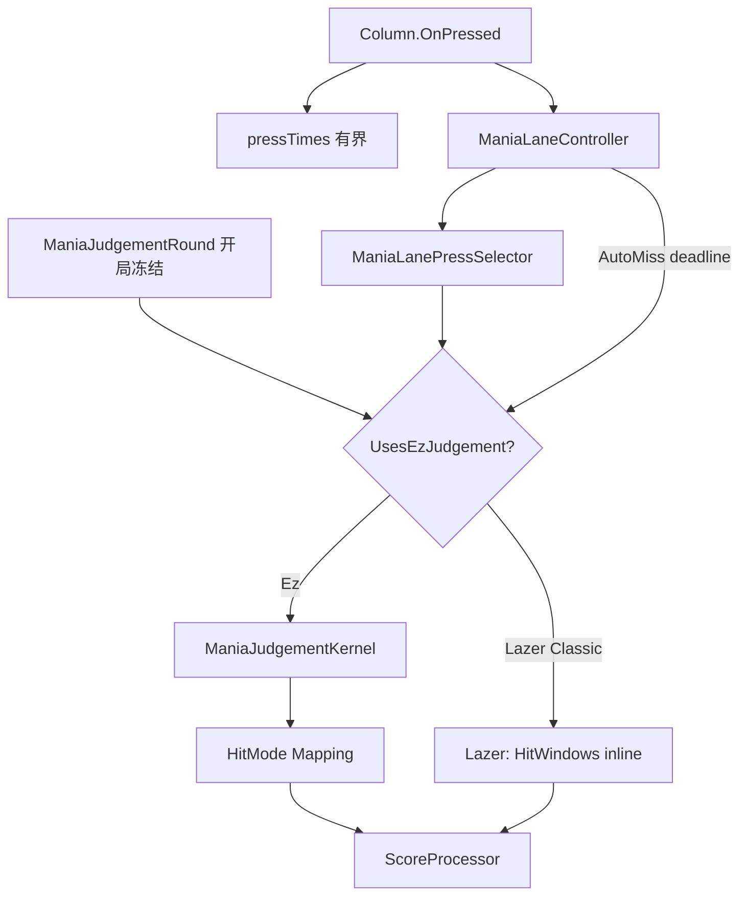

# Mania 判定

局内怎么判、和 Session 哪里同调/双份、成绩数据原则、下一步删双份顺序。  
跨模式 Session/Timeline → [`session.md`](./session.md)；掉帧 → [`performance.md`](./performance.md)。

---

## 1. 金标

同 score + 同 environment：`ManiaReplaySession.Run` 的 HitEvents + Score ≡ Drawable / ReplayPlayer 一遍后的 `ScoreProcessor`。

| 路径 | HitEvents |
|------|-----------|
| 刚打完 / 看回放 | SP `PopulateScore`（有画面） |
| 排行榜补事件 / 重算 | Session（无画面，须等价） |

Parity：`TestSceneReplaySessionParity`、`ManiaCrossSourceInvariantTest`、`ManiaJudgePrecedenceParityTest`。  
禁止：用 Session silent 覆盖 Realm Statistics（例外：用户显式「成绩重算」）；恢复 drawable 分析 fallback。

---

## 2. 局内拓扑

| 层 | 职责 | 锚点 |
|----|------|------|
| L0 | 开局冻结 HitMode/Poor/Precedence | `ManiaJudgementRound` |
| L2 路由 | 叠键选目标、AutoMiss 队列 | `ManiaLaneController` + `ManiaLanePressSelector` |
| L2 判官 | offset → HitResult | `ManiaJudgementKernel` → Mapping |
| L3 | 输入、ApplyResult、视觉、LN 持有 | `Column` / Drawable |

按键：`Column` → `SelectPressEntry` → Note/Hold → Ez 走 Kernel；Lazer 走 Drawable inline。  
被动 Miss：`ProcessAutoMiss` → `UpdateResult(false)`。

---

## 3. M / N 同调

| 盒子 | 同调？ | 税 |
|------|--------|----|
| Round / env | 语义同源 | 低 |
| Kernel + Ez Mapping | **共用** | 低 |
| `ManiaLanePressSelector` | **共用** | 低 |
| Lazer inline ↔ `Lazer*Replica` | **双份数学** | **P0** |
| AutoMiss 时机 | 驱动镜像 | P1 |
| LN ActiveHold | 驱动镜像 | P1 |
| pressTimes ↔ replay 边沿 miss offset | 公式应对齐 | P2 |
| MLC 状态 ↔ `LaneTargetState` | 刻意分离 | P2 |

Ez：「等级怎么判」已单源。痛点在 Lazer 数学双轨 + AutoMiss/LN 驱动。

**绑定**：一 beatmap 实例 = 一 hitmode；Session 用 `ManiaSimulationBeatmapProvider` 副本，勿喂 live 实例。

**KPoor**：仅 BMS HitMode + BMS HealthMode + `BmsPoorHitResultEnable`；M/N 同一 `poorEnabled` 公式。

---

## 4. 数据原则（⛔）

| 原则 |
|------|
| Gameplay 入库 = 当场 SP，不经 Session |
| 手动「成绩重算」= 唯一产品层 Session→写 Realm Statistics |
| HitEvents **不**持久化；Panel 可 Session 补 HitEvents（不写 Statistics） |
| Graph **Now** = replay + ForLive Session，不读 Realm 数字冒充 Now |
| Graph **Original** / list 卡 = Realm 快照 |
| 禁止 UI 过滤掩盖 Statistics 真差异；禁止入库前 Session 同步 |
| HitMode `0`=Lazer；无「未设置」档 |

场景：本地玩/回放→M；重算/Graph Now/补 HitEvents/Race→N。

---

## 5. 删双份顺序（未改代码清单）

**U1 P0 — Lazer 数学单源**  
Replica 成唯一数学源；Drawable Lazer `CheckForResult` 一行委托。  
文件：`Replicas/Lazer*JudgementReplica.cs`、`ManiaJudgementRegistry`、`DrawableNote`/`HoldTail`、`IManiaHitModeJudgement` 注释。  
验收：现有 parity 绿 + Lazer 轨 Drawable≡Session。

**U2 P1 — AutoMiss / LN**  
截止时刻与 LN 松手/断连抽成纯函数；M/N 只注入状态。  
验收：断连/重按 parity；被动 Miss `TimeOffset` M≡N；micro-bench 不回退。

**U3** — Osu 编排后置；Taiko/Catch 跟 Mapping；禁 Headless DrawableRuleset 当 Session。

---

## 6. 反模式

| 禁 | 说明 |
|----|------|
| Headless 整棵 DrawableRuleset 当 Session | — |
| HitEvents→SP 建 Timeline（F/E） | 见 session.md |
| Lazer 再写第二套 ResultFor | U1 目标 |
| 热路径读 GlobalConfig | 走 Round |
