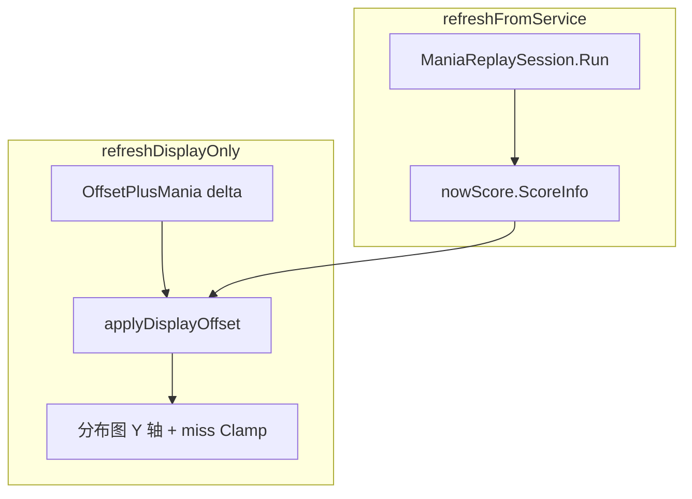
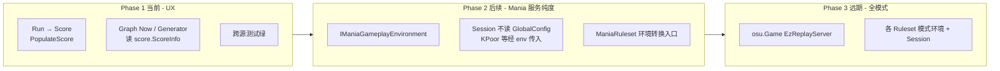

# Mania ReplayJudge — ppy 合并 checklist

## Session 黄金标准（#66）

**验收标准（与旧 generator 无关）**：

> 同一 score + 同一 environment 下，`ManiaReplaySession.Run` 产出的 **HitEvents + Score** 必须与「完整 Drawable 游玩或 ReplayPlayer 回放一遍，进入结算时 `ScoreProcessor` 已填充的结果」**字段级一致**。

| 路径 | 是否绘制 | HitEvents 来源 |
|------|---------|----------------|
| 刚打完 / ReplayPlayer 回放 | 是 | `ScoreProcessor.PopulateScore` → 内存 HitEvents |
| 排行榜 / 选歌重算 | **否** | `ManiaReplaySession.Run` → **必须等价于上表** |

`ManiaScoreHitEventGenerator` 仅为 StatisticsPanel 薄壳委托 Session，**不是**参考实现；Drawable/Replay 游玩后的 `ScoreProcessor` 输出才是唯一黄金标准。

**每条 HitEvent 须一致**：`Result`、`TimeOffset`（含 OffsetPlusMania 用于判定但存储 offset 与 Drawable 相同：`eventTime - GetEndTime()`）、`GameplayRate`、`HitObject` / `LastHitObject`。

`ScoreInfo.HitEvents` 带 `[Ignored]` 不持久化；排行榜进结算只能 Session 重算——Session 不等价则拓展分析与「刚打完」必然分裂。

**禁止**恢复 drawable 分析 fallback；Session 做到等价即可。

Parity 测试：`TestSceneReplaySessionParity`（Drawable replay vs Session，完整 HitEvent 字段）。

---

## 完整成绩数据流（#66）

### 原本链路

1. **看成绩**：Realm 持久化 `Statistics` / Acc / TotalScore；`HitEvents` **不**持久化。
2. **补 HitEvents**：`StatisticsPanel` → `EzScoreReloadBridge` → `ManiaScoreHitEventGenerator` → `ManiaReplaySession.Run`（**只**写回 `ScoreInfo.HitEvents`，**不** patch Statistics）。
3. **分布图 EzScoreGraph**：
   - **Original**：Realm 静态快照（`Score.Accuracy` / `TotalScore` / 卡片 Statistics）。
   - **Now**：`ManiaReplaySession.Run` + `GameplayEnvironment.FromLive`（当前全局 HitMode 等），读 `score.ScoreInfo`（Statistics / Acc / TotalScore / HitEvents），**禁止**在 Graph 内另建 offset 重算 / 判定映射副本。
   - **V1**：Classic 假想重算（独立路线，可与 V2 不同）。

### 同环境等价（成绩嵌入配置 ≡ 当前全局）

| 数据源 | 必须一致 |
|--------|---------|
| Realm `Statistics` | ✓ |
| Graph Original | ✓ |
| Graph Now（Session FromLive） | ✓ |
| `aggregate(Session HitEvents by Result)` | ≡ SP `Statistics` |

`ManiaReplaySession.Run` 经 `ScoreProcessor.PopulateScore` 写回传入的 `Score` 并返回；Graph / 测试读 `score.ScoreInfo`。`RunHitEvents` 为工具 API（`Run(...).ScoreInfo.HitEvents`），当前生产路径不调用。StatisticsPanel / Bridge **只** patch HitEvents，**不**用 Session 覆盖 Realm `Statistics`。

**诊断语义**：Session HitEvents 与 Realm Statistics 并存且同环境应一致；若矛盾 → Session / 环境对齐有误，**禁止**用 Session 覆盖 StatisticsPanel 中的 Statistics。

跨源测试：`ManiaCrossSourceInvariantTest`（HitEvents 聚合 ≡ Statistics、FromScore ≡ FromLive、Session 确定性）。

---

## 架构：HitMode 原生判定 + MapTo

每个 Ez HitMode 在 `EzMania/ReplayJudge/Mappings/{Mode}HitModeJudgement.cs` **单文件**内包含：

1. **Mode 原生 enum**（如 `BmsJudge.Bad`、`O2Judge.Cool`）
2. **`MapTo(judge) → HitResult`**（写入 ScoreProcessor / ApplyResult 边界才转换）
3. **核心判定**（窗口、KPoor 状态机、pill、tail 等）
4. **`IManiaHitModeJudgement` 实现**（Session 与 Drawable 共用）

对话与代码审查优先使用 Mode 名，避免与 Lazer Perfect/Great/Meh 混淆。

### 双轨

| 路径                             | 判定源                                                               |
|--------------------------------|-------------------------------------------------------------------|
| Lazer/Classic 游玩               | 官方 `DrawableNote.CheckForResult` inline（不抽离）                      |
| Lazer/Classic Session          | `Replicas/Lazer*JudgementReplica`                                 |
| Ez HitMode 游玩                  | `DrawableNote` 一行 Switcher → `ManiaEzDrawableJudgement` → Mapping（**禁止** HitMode 专用 Drawable 子类；Malody LN 等同理） |
| Ez HitMode Session / Generator | `ManiaReplaySession` → `ManiaJudgementRegistry` → 同一 Mapping      |

Drawable replay 播放时，`ManiaEzDrawableJudgement` 优先从 `DrawableRuleset.ReplayScore.ScoreInfo` 取 HitMode（`FromScore`），无 embedded 时回退 `FromLive`。

### 成绩统计环境

| 字段                                 | 来源                                                                                   |
|------------------------------------|--------------------------------------------------------------------------------------|
| HitMode / HealthMode（统计 HitEvents） | `ScoreInfo.ManiaHitMode` / `ManiaHealthMode`（提交时写入）→ `GameplayEnvironment.FromScore` |
| HitMode / HealthMode（角逐时间线）     | **当前全局** `FromLive`；不读成绩嵌入字段                                                     |
| JudgePrecedence / OffsetPlusMania  | 当前全局配置（`FromLive` fallback）                                                          |
| **BmsPoorHitResultEnable (KPoor)** | **当前全局配置**（未写入 ScoreInfo；统计重算沿用打开成绩时的全局 KPoor 开关，与当时游玩可能不一致）                         |

生产入口：`StatisticsPanel` → `EzScoreReloadBridge` → `ManiaScoreHitEventGenerator` → `ManiaReplaySession`。

`ManiaRuleset.RunReplayAsync` 为无 UI 公开 API，返回 `Run` 填充后的 `Score`，与 Generator 同源。

### 分数时间线（角逐 HUD 等下游消费）

| 路径 | 数据源 |
|------|--------|
| 统计 / HitEvents | `ManiaReplaySession.Run` → `PopulateScore` → `ScoreInfo` |
| **时间线** | `ManiaReplaySession.RunTimeline` → 同一遍 SP，每次 `ApplyResult` 后采 `TotalScore`/`Accuracy`/… 快照 → `EzScoreTimeline` |

- **禁止** Mania 生产路径：`HitEvents` → `buildFromHitEvents` → 第二遍 SP。
- 下游（如角逐 HUD）只调用 `EzScoreTimelineBuilder.TryBuild`；`EzScoreTimelineBridge` 在 Mania 侧注册 `RunTimeline`。
- 无本地 replay（`GetScore` 后 `Replay == null` 或空帧）→ `TryBuild` 返回 `null`；角逐 ghost 在 timeline 未就绪前显示 0，**禁止**用终局 `ScoreInfo.TotalScore` 充当实时分。
- 时钟轴 = replay 输入时刻（`input.Time`），与游玩 `GameplayClock` 对齐。
- Ez 满分制 `TotalScore` = 整谱 ex 累积（`MinimumAccuracy × 1M`），与正常游玩 ScoreProcessor 同源；ghost 分数轨 = 同一 SP 快照，HUD **只读** `QueryAtTime(...).TotalScore`，不在 EzOsuGame 复刻公式。

### 角逐 HUD 实机验收清单（Mania）

1. 本地 Mania 谱面 ≥2 条带 replay 的 ghost + 角逐排行榜：占位先出（分数 0），时间线异步填入后分数/准度/Combo 随时钟变化。
2. 同一时刻：主界面 ScoreCounter ≈ 角逐 Tracked 行 ≈ ghost 行（对应 replay 进度）；分数从 0 累积，无 acc 子集反算虚高。
3. 角逐榜排序可配置（默认 TotalScore，可选 Accuracy / MissCount）；只影响榜位，不参与计分。
4. ghost 分数轨统一按**当前全局** HitMode/HealthMode 重算（`FromLive`）；不用成绩嵌入 HitMode，也不按嵌入 HitMode 过滤 ghost 列表。
5. 无 replay 的 ghost：不进入角逐列表（`TryBuild` 返回 null）。
6. DT/HT：时钟与 ghost 分数轨无明显错位（若有问题记录谱面与 mod 组合）。

---

## Phase 1 Session API（当前）

```csharp
// 生产主路径
public static Score Run(Score score, IBeatmap beatmap, IGameplayEnvironment environment, CancellationToken ct = default);

// 工具 API：保留，当前生产路径不调用
public static IReadOnlyList<HitEvent> RunHitEvents(...)
    => Run(...).ScoreInfo.HitEvents;

// 不变
public static EzScoreTimeline RunTimeline(...);
```

`Run` 末尾：`scoreProcessor.PopulateScore(score.ScoreInfo); return score;`

**Phase 1 刻意保留（Phase 2 再改）**：

- Session 仍接受现有 `IGameplayEnvironment`（不新建 `IManiaGameplayEnvironment`）
- `ManiaReplaySessionSimulator` 内 `BmsPoorHitResultEnable` 读 `GlobalConfigStore` — 已知技术债
- Generator / Graph 仍在调用侧 `FromScore` / `FromLive`（不经 Ruleset ResolveEnvironment）

---

## Phase 1.5 Graph Now + Miss Offset（当前）

### 1.5a — Graph Now 消费完整 Score

- **Original**：Realm 静态 `ScoreInfo`（构造时传入）
- **Now**：`ManiaReplaySession.Run(env)` 返回的完整 `Score`；Graph 只读 `nowScore.ScoreInfo.*`
- 禁止拆字段、禁止 `applyFallbackV2FromHitEvents` 二次喂 SP
- 改 HitMode / HealthMode / JudgePrecedence / BmsPoor → `refreshFromService()` 重跑 Session

### 1.5b — Miss TimeOffset 数据保真

- miss 压边是 **UI 优化**（`applyDisplayOffset` + `projectOffsetToY` Clamp），Session **不写假 offset**
- `buildPressTimesByColumn` + `resolveMissStoredOffset` / `resolveMissEventTime`：列内最近邻 press；无输入则 stored offset 为 0（Graph 压边展示）
- 删除 `estimateUnjudgedMissOffset`（统一 `missLate-0.01`）

### 1.5c — OffsetPlusMania 性能

- **滑动 offset**：不调 Session；缓存 HitEvents 的 stored TimeOffset + delta 做 UI 平移
- `offsetPlusMania` bindable → `refreshDisplayOnly()`（仅 `Refresh()`）
- Result 随 offset 重算 → **后续**；1.5 滑动阶段保持 `RecalculateV2Result => Result`



**测试**：`ManiaReplayMissOffsetTest`（ForceMiss / sweep miss 的 TimeOffset 不全相等；无输入列 offset=0）

---

## 分阶段服务化路线（远期，非本次实现）



| 阶段 | 目标 |
|------|------|
| **Phase 1** | #66 UX：同环境 Realm ≡ Graph Original ≡ Graph Now；API 去臃肿（`Run → Score`） |
| **Phase 1.5** | Graph Now 完整 Score；miss 真实 TimeOffset；OffsetPlusMania UI 快路径 |
| **Phase 2** | Mania 环境分层、Session 零全局读、Ruleset 统一 ResolveEnvironment |
| **Phase 3** | `osu.Game` EzReplayServer 框架 + Osu/Taiko/Catch/Mania 各模式 Session |

**Phase 2 预览**：新增 `IManiaGameplayEnvironment : IGameplayEnvironment`（含 `BmsPoorHitResultEnable` 等）；`ManiaRuleset.ResolveEnvironment` 在规则集边界转换；Session / Simulator 零 `GlobalConfigStore`。

**Phase 3 预览**：`osu.Game/EzOsuGame/Replay/`（或等价路径）统一 `RunReplay(Score, IBeatmap, IGameplayEnvironment) → Score`；规则集注册 `IReplaySession` / 环境转换器；Mania 为首个完整实现。

---

## 合并 ppy/osu master 后

1. **diff 官方判定入口**
   - `Objects/Drawables/DrawableNote.cs` → `CheckForResult`
   - `Objects/Drawables/DrawableHoldNoteTail.cs` → `CheckForResult` / `GetCappedResult`
   - `UI/OrderedHitPolicy.cs` → Earliest / Combo 路由

2. **同步 Ez Replica**（仅 Session，官方不引用）
   - `Replicas/LazerNoteJudgementReplica.cs`
   - `Replicas/LazerHoldJudgementReplica.cs`
   - `ManiaColumnSimulator.cs`（Earliest note lock）

3. **Ez Mapping 不需 diff 官方**；合并上游后若 HitMode 行为变更，只改对应 `Mappings/*HitModeJudgement.cs`。

4. **跑 parity**
   - `ManiaCrossSourceInvariantTest`（Run：HitEvents 聚合 ≡ Statistics、同环境 FromScore ≡ FromLive）
   - `TestSceneReplaySessionParity`（Drawable vs Session：Lazer tap/hold、IIDX tap/hold、O2 tap/hold/pill、Ez2AC hold、Malody hold）
   - `JudgePrecedenceRoutingRegressionTest`
   - `dotnet test osu.Game.Rulesets.Mania.Tests`（全量）
